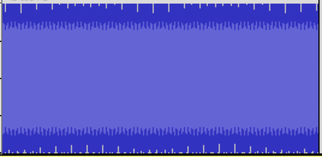
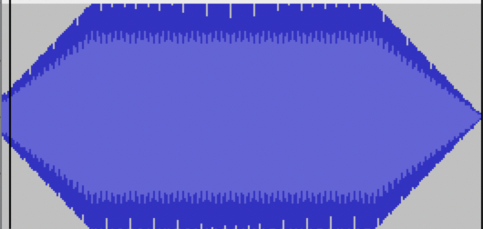

# ALGOSUP_2022_Project_3_A | Sound Synthesizer

## **Project:**

The project given by [*Algosup*](https://www.algosup.com/fr/index.html) and [*Robert Pickering*](https://github.com/robertpi) was to create a Sound Synthesizer able to open, modify, create and save sounds.

## **Getting Started**

## Prerequisites

- Download .Net 6.0 or newer

## .Net CLI

> dotnet add package Synthesizer.Json

## windows

> Install-Package Synthesizer.Json

## **Project members**

[*Ivan Molnar*](https://github.com/ivan-molnar) <br>
[*Clement Caton*](https://github.com/ClementCaton) <br>
[*Louis de Choulot*](https://github.com/Louis-de-Lavenne-de-Choulot) <br>
[*Théo Diancourt*](https://github.com/TheoDct) <br>
[*Mathieu Chaput*](https://github.com/Chaput-Mathieu) <br>
[*Léo Chartier*](https://github.com/leo-chartier)

# Project documentation

## **NuGet install**
<!-- KFC goes here -->

## **Basic structure**

To interract with the library you'll have to mainly interract with two objects.
The ``Synth`` object which is the actual sound synthesizer and the ``Filter`` object which contains a list of function that will allow you to modify the created sounds.

## **Reading files**

## Reading wav files

You can extract data from a wav file in the default ``/Output/`` folder using ``Synth.ReadFromWav name.Wav``

You can open it from your own path using ``readFromWavWithPath /path-to.Wav``

## Reading mp3 files

<span style="color: red;">WIP</span>

You can extract data from a wav file in the default ``/Output/`` folder using ``Synth.ReadFromWav name.mp3``

You can open it from your own path using ``readFromWavWithPath /path-to.mp3``

## **Writing to files / Saving**

## Writing to wav files

## Writing to mp3 files

<span style="color: red;">WIP</span>

## **Dealing with stereo**

## **Creating basic audio data**

The library supports the creation

## Creating audio data with an envelope

## Creating audio data with a custom envelope

## **Finding frequencies from notes and octaves**

A more simplified way to find the sound you are looking for is trought musical octaves[^1] and notes[^2].
To call on this form of notation you'll have to use the ``Synth.getNoteFreq (octav:int) (note:Note)`` function to get the right frequency.

Example:

```fs
let note = Synth.getNoteFreq Note.C 4 // This returns the frequency of the C4 note
```

Alternatively, you could directly create a SinWave using the ``Synth.note (duration:Duration) (note:Note) (octav:int)``.

Example:

```fs
let note = Synth.note Half Note.C 4 // This returns the frequency a half duration of the C4 note
```

## Finding notes with a custom default frequency

In most cases, the frequency of a note is calculated from a default frequency (mostly, 440Hz for the A4 note).
However, in some cases, you might need to find a note from a different starting frequency.
This can be done using the ``Synth.getNoteFreqOffset (octav:int) (note:Note) (aFourFreq:Float)``

Example:

```fs
let note = Synth.getNoteFreqOffset Note.C 4 444. // This returns the frequency of the C4 note calculated from the starting point 444Hz at the A4 note
```

## **Creating silence**

Creating silence is as simple as calling the ``Synth.silence (duration:Duration)`` function.

```fs
let silence = Synth.silence (Seconds 2) // Returns 2 seconds of silence
```

## **Additioning audio data**

## Additioning audio with a predefined ratio

## **Composing**

One thing you have to be aware of is the ``cutCorners`` function.
When we first created the compose function we encounterd a strange, small sound between easch end every note.
This sound was caused by the notes ending on a not-zero amplitude.

The solution was to add in a filter that gradually lowers the amplitude of the notes start and end to 0.

|          Before cutCorne             |          After cutCorner            |
|:------------------------------------:|:-----------------------------------:|
|   |   |


Therefore; the``Synth.compose (sounds:List<float>)`` function has a default cutCorner value of 100 (this means it cuts away from the first and last 100 bytes from each note).

Example:

```fs
let C4 = Synth.note Half Note.C 4   // init
let D4 = Synth.note Half Note.D 4   //
let silence = Synth.silence Quarter //
let B5 = Synth.note Half Note.B 5   //

let music = Synth.compose [          // Returns a single, large sound composed of the smaller sounds given to it
    C4;
    C4;
    D4;
    silence;
    B5;
]
```

In certain cases, one might need to set a custom value to the cutCorner function.
This can be done with the ``Synth.composeCutCorner (corner:int) (sounds:List<float>)``

```fs
let music = Synth.composeCutCorner 1000 [
    C4;
    C4;
    D4;
    silence;
    B5;
]
```

Alternatively, one might want to compose without the cutCorners filter.
This can be done either by giving it a 0 value or by using the ``Synth.composeNoCutCorner (corner:int) (sounds:List<float>)`` function.

With zero value:

```fs
let music = Synth.composeCutCorner 0 [
    C4;
    C4;
    D4;
    silence;
    B5;
]
```

Or with ``composeNoCutCorner``:

```fs
let music = Synth.composeNoCutCorner [
    C4;
    C4;
    D4;
    silence;
    B5;
]
```

These two are equivalents.

## **Preview**

## **Frequency analysis**

## **Filters**

## Apply multiple filters at once

## Cutting audio

Cutting audio is simple. You can use the following functions

- ``Synth.cutStart (sampleRate:float) (time:float) (data:List<float>)`` : Cuts the start of the audio data returning the end part
  
- ``Synth.cutEnd (sampleRate:float) (time:float) (data:List<float>)`` : Cuts the end of the audio data returning the first part
  
- ``Synth.cutMiddle (sampleRate:float) (timeStart:float) (timeEnd:float) (data:List<float>)`` : Cuts out the middle of the audio data and returns the edges merged together
  
- ``Synth.cutEdge (sampleRate:float) (timeStart:float) (timeEnd:float) (data:List<float>)`` : Cuts of both ends of the audio data and returns the middle part

Example:
```fs
let a = Synth.note (Seconds 1) Note.A 4
let b = Synth.note (Seconds 1) Note.B 4
let c = Synth.note (Seconds 1) Note.C 4
let d = Synth.note (Seconds 1) Note.D 4

let full = Synth.compose 0 [a; b; c; d;]        // Complete sound, takes 4 second and plays 4 different notes

let lastThree = Synth.cutStart 44100. 1. full   // Cuts first note, leaving last 3
let firstThree = Synth.cutEnd 44100. 1. full    // Cuts last note, leaving first 3
let edges = Synth.cutMiddle 44100. 1. 1. full   // Cuts out the 2 middle notes, leaving the first and the last ones
let second = Synth.cutMiddle 44100. 1. 2. full  // Cuts the first and the last 2 notes, leaving the second one
```

## Changing amplitude

## Reverb, Echo and chorus

## Flanger

## Envelope

## Custom envelope

## Low frequency oscillation

### AM

### FM

## LowPass / HighPass / BandPass / RejectBand filters

# Footnotes

Info on [**.mp3 files**](https://github.com/ClementCaton/ALGOSUP_2022_Project_3_A/blob/main/Informations/INFO%20mp3.md)<br>
Info on [**.Wav files**](https://github.com/ClementCaton/ALGOSUP_2022_Project_3_A/blob/main/Informations/INFO.md)<br>
Link to our [**Trello**](https://trello.com/b/itooTuBY/algosup2022project3a)<br>
Link to our [**Functional Specifications**](https://github.com/ClementCaton/ALGOSUP_2022_Project_3_A/blob/main/Reports/Functional%20specification.md)<br>
Link to our [**Technical Specifications**](https://github.com/ClementCaton/ALGOSUP_2022_Project_3_A/blob/main/Reports/Technical%20specification.md)<br>
Link to our [**Software Architecture Design Choices**](https://github.com/ClementCaton/ALGOSUP_2022_Project_3_A/blob/main/Reports/Software%20architecture%20design%20choices.md)

## **Definitions**

[^1]: Octaves: A series of eight notes occupying the interval between (and including) two notes, one having twice or half the frequency of vibration of the other.

[^2]: Notes: A note is a symbol denoting a musical sound.
