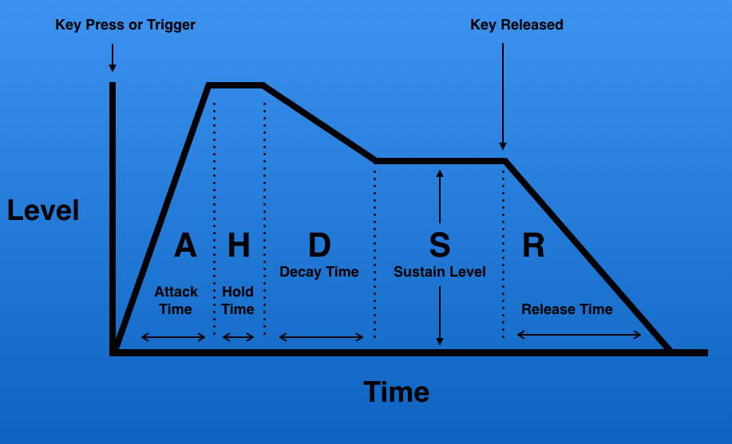
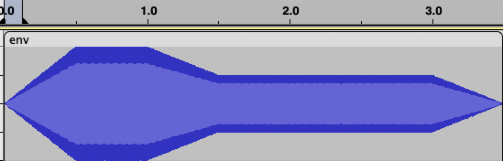
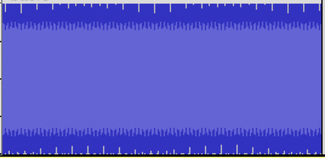
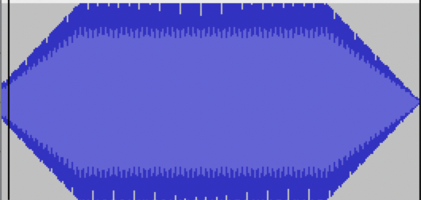
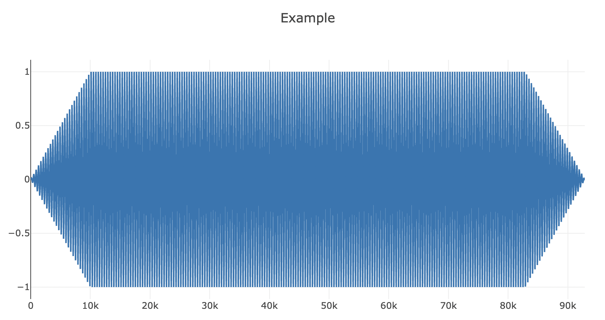
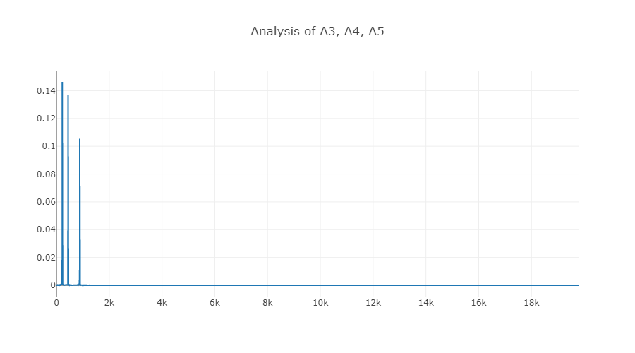
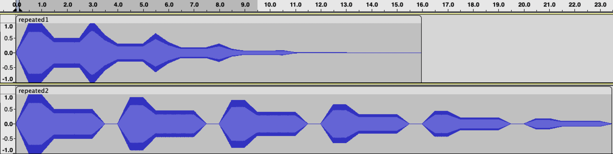

# ALGOSUP_2022_Project_3_A | Sound Synthesizer

## **Project:**

The project given by [*Algosup*](https://www.algosup.com/fr/index.html) and [*Robert Pickering*](https://github.com/robertpi) was to create a Sound Synthesizer able to open, modify, create and save sounds.

## **Getting Started**

<br>

## **Project members**

[*Ivan Molnar*](https://github.com/ivan-molnar) <br>
[*Clement Caton*](https://github.com/ClementCaton) <br>
[*Louis de Choulot*](https://github.com/Louis-de-Lavenne-de-Choulot) <br>
[*Théo Diancourt*](https://github.com/TheoDct) <br>
[*Mathieu Chaput*](https://github.com/Chaput-Mathieu) <br>
[*Léo Chartier*](https://github.com/leo-chartier)

# Project documentation

## Prerequisites

- Download .Net 6.0 or newer

<br>

## .Net CLI

``dotnet add package Synthesizer --version 1.1.0``

<br>

## Windows

``Install-Package Synthesizer -Version 1.1.0``

<br>

## Package Reference

``<PackageReference Include="Synthesizer" Version="1.1.0" />``

<br>

## **Installation**

## **Basic structure**

To interract with the library you'll have to mainly interract with two objects.
The ``Synth`` object which is the actual sound synthesizer and the ``Filter`` object which contains a list of function that will allow you to modify the created sounds.

## **Reading files**

## Reading wav files

You can extract data from a wav file in the default ``/Output/`` folder using ``Synth.ReadFromWav (fileName:string)``.

You can open it from your own path using ``Synth.readFromWavWithPath (filePath:string)``.

These functions return a tuple containing the ``soundData:list<list<float>>``, ``duration:float``, ``sampleRate:int`` and the ``bitsPerSample:int``.

Example:

```fs
let inOutputData, inOutputDuration, inOutputSampleRate, inOutputBPSampleRate = synth.ReadFromWav "yourFileName.wav"     // get everything from a file in the Output folder

let fromPathData, _, fromPathSampleRate, _ = Synth.readFromWavWithPath "/yourPath/yourFileName.wav"     // get only the sound data and the samplerate from a predefined path
```

## Reading mp3 files

<span style="color: red;">WIP</span>

<!-- You can extract data from a wav file in the default ``/Output/`` folder using ``Synth.ReadFromMp3 name.mp3``

You can open it from your own path using ``readFromWavWithPath /path-to.mp3`` -->

## **Writing to files / Saving**

## Writing wav files

You can save files by writing data into them with the function ``Synth.WriteToWav name music``. This function will put files in the folder "./Output".

Example :

```fs
Synth.WriteToWavWithPath "name.wav" sound// This will save the sound in the file from the path "./Output/name.wav".
```

You can also save files by writing data into them with the function ``Synth.WriteToWavWithPath path fileName music``. This function will put files in "path/fileName".

Example :

```fs
Synth.WriteToWavWithPath "./folder/" "name.wav" sound // This will save the sound in the file from the path "./folder/name.wav".
```

## Writing mp3 files

<span style="color: red;">WIP</span>

## **Playing music**

Your Os is automatically detected to use either SFML on windows or afplay on Mac, this function does not support Linux yet.

You can play music from the code ``Synth.PlayWav offset data``.

Example :

```fs
Synth.PlayWav 0. data // This will play the sound in the variable data with an offset of 0 second.
```

You can also play music from a file with ``Synth.PlayWavFromPath offset (filePath:string)``

Example :

```fs
Synth.PlayWavFromPath 0. "./Output/name.wav" // This will play the sound in the file from the path "./Output/name.wav" with an offset of 0 second.
```

Each sound will be played one by one. For the next sound to be played (or to end the program if there aren't any more sounds) you need to press the enter key.

## **Dealing with stereo**

<span style="color: red;">WIP</span>

## **Creating audio data**

You can create some basic audio using ``Synth.Sound (frequency:float) (duration:Duration) (waveType:BaseWaves)``

Example:
```fs
let synth = Synth() // Init
let newSound = synth.Sound 440. (Seconds 1.) Sin    // Create a 1 second sinwave with a frequence of 440.
let newSound2 synth.Sound (synth.getNoteFreq 3 Note.F) Half Triangular // Create a triangular F3 half note.
```

Alternatively, it is possible to directly create a note with the ``synth.Note (duration:Duration) (mNote:Note) (octave:int)``.

Example:
```fs
let synth = Synth() // Init
let newNote = synth.Note Quarter Note.D 5 // Create a D5 quarter note.
```

## Creating audio data with an envelope

In order to create a sound with an enveloppe you need to use ``Synth.SoundWithEnveloppe (frequency:float) (duration:Duration) (waveType:BaseWaves) (sustain:float) (attack:float) (hold:float) (decay:float) (release:float)``.

We are using a basic AHDSR envelope:


Example:
```fs
let synth = Synth() // Init
let sound = synth.SoundWithEnveloppe 440. (Seconds 3.) Sin 0.5 0.5 0.5 0.5 0.5  // Create sound with envelope
```

The above example creats the following sound:


<sup>* Please note: when we create a new sound with this methode the release adds data at the end of the normal data.</sup>

## Creating audio data with a custom envelope

<span style="color: red;">WIP</span>

## **Finding frequencies from notes and octaves**

A more simplified way to find the sound you are looking for is trought musical octaves[^1] and notes[^2].
To call on this form of notation you'll have to use the ``Synth.getNoteFreq (octav:int) (note:Note)`` function to get the right frequency.

Example:

```fs
let Note = Synth.GetNoteFreq Note.C 4 // This returns the frequency of the C4 note
```

Alternatively, you could directly create a SinWave using the ``Synth.note (duration:Duration) (note:Note) (octav:int)``.

Example:

```fs
let Note = Synth.Note Half Note.C 4 // This returns the frequency a half duration of the C4 note
```

## Finding notes with a custom default frequency

In most cases, the frequency of a note is calculated from a default frequency (mostly, 440Hz for the A4 note).
However, in some cases, you might need to find a note from a different starting frequency.
This can be done using the ``Synth.getNoteFreqOffset (octav:int) (note:Note) (aFourFreq:Float)``

Example:

```fs
let Note = Synth.GetNoteFreqOffset Note.C 4 444. // This returns the frequency of the C4 note calculated from the starting point 444Hz at the A4 note
```

## **Creating silence**

Creating silence is as simple as calling the ``Synth.silence (duration:Duration)`` function.

```fs
let Silence = Synth.Silence (Seconds 2) // Returns 2 seconds of silence
```

## **Cutting audio**

Cutting audio is simple. You can use the following functions

- ``Synth.cutStart (sampleRate:float) (time:float) (data:List<float>)`` : Cuts the start of the audio data returning the end part
  
- ``Synth.cutEnd (sampleRate:float) (time:float) (data:List<float>)`` : Cuts the end of the audio data returning the first part
  
- ``Synth.cutMiddle (sampleRate:float) (timeStart:float) (timeEnd:float) (data:List<float>)`` : Cuts out the middle of the audio data and returns the edges merged together
  
- ``Synth.cutEdge (sampleRate:float) (timeStart:float) (timeEnd:float) (data:List<float>)`` : Cuts of both ends of the audio data and returns the middle part

Example:

```fs
let a = Synth.note (Seconds 1) Note.A 4
let b = Synth.note (Seconds 1) Note.B 4
let c = Synth.note (Seconds 1) Note.C 4
let d = Synth.note (Seconds 1) Note.D 4

let full = Synth.compose 0 [a; b; c; d;]        // Complete sound, takes 4 second and plays 4 different notes

let lastThree = Synth.cutStart 44100. 1. full   // Cuts first note, leaving last 3
let firstThree = Synth.cutEnd 44100. 1. full    // Cuts last note, leaving first 3
let edges = Synth.cutMiddle 44100. 1. 1. full   // Cuts out the 2 middle notes, leaving the first and the last ones
let second = Synth.cutMiddle 44100. 1. 2. full  // Cuts the first and the last 2 notes, leaving the second one
```

## **Additioning audio data**

<span style="color: red;">WIP</span>

## Additioning audio with a predefined ratio

<span style="color: red;">WIP</span>

## **Composing**

One thing you have to be aware of is the ``cutCorners`` function.
When we first created the compose function we encounterd a strange, small sound between easch end every note.
This sound was caused by the notes ending on a not-zero amplitude.

The solution was to add in a filter that gradually lowers the amplitude of the notes start and end to 0.

|          Before cutCorne             |          After cutCorner            |
|:------------------------------------:|:-----------------------------------:|
|   |   |
<sup>* for the shake of the example, the filter has been exagerated</sup>

Therefore; the``Synth.compose (sounds:List<float>)`` function has a default cutCorner value of 100 (this means it cuts away from the first and last 100 bytes from each note).

Example:

```fs
let C4 = Synth.Note Half Note.C 4   // init
let D4 = Synth.Note Half Note.D 4   //
let Silence = Synth.Nilence Quarter //
let B5 = Synth.Note Half Note.B 5   //

let Music = Synth.Compose [          // Returns a single, large sound composed of the smaller sounds given to it
    C4;
    C4;
    D4;
    Silence;
    B5;
]
```

In certain cases, one might need to set a custom value to the cutCorner function.
This can be done with the ``Synth.ComposeCutCorner (Corner:int) (Sounds:List<float>)``

```fs
let Music = Synth.ComposeCutCorner 1000 [
    C4;
    C4;
    D4;
    Silence;
    B5;
]
```

Alternatively, one might want to compose without the cutCorners filter.
This can be done either by giving it a 0 value or by using the ``Synth.composeNoCutCorner (corner:int) (sounds:List<float>)`` function.

With zero value:

```fs
let Music = Synth.ComposeCutCorner 0 [
    C4;
    C4;
    D4;
    Silence;
    B5;
]
```

Or with ``composeNoCutCorner``:

```fs
let Music = Synth.ComposeNoCutCorner [
    C4;
    C4;
    D4;
    Silence;
    B5;
]
```

These two are equivalents.

## **Preview**

Its possible to create a preview of an audio loaded into the filter using the ``Synth.preview (title:string) (sound:List<float>)`` function.

Example:

```fs
let basic = Synth.note Whole Note.A 2       // reating a basic note
let cut = Utility.cutCorners 5000 basic     // Making it look a bit more interresting

Synth.preview "Example" cut |> ignore       // Launch preview
```

The above example automatically opens the browser with the following image :



Tools to zoom/zoom out are also present on the page.

## **Frequency analysis**

It's possible to create a frequency analysis by using a fourrier transform on an audio file using :
``member x.Fourier (data:List<float>) =
        FrequencyAnalysis.Fourier x.sampleRate data``

Example : 
```fs

```

The above example automatically opens the browser with the following image :



Tools to zoom/zoom out are also present on the page.

## **Filters**

## Usable Filters

To complement your sounds you can add some filters :

- Flanger

- Echo

- Reverb

- Envelope

- LFO AM

- LFO FM

- Low Pass

- High Pass

## Apply multiple filters at once

You can use this function to apply multi filters at once : 

```fs
member x.ApplyFilters filters data =
    Filter.ApplyFilters filters data
```

Like so :
```fs
let x = Synth()

let MusicWithFilters = x.ApplyFilters [
    Filter.ChangeAmplitude 0.5;
    Filter.LowPass 44100. 400.;
    Filter.Echo 4 0.7 1.5 44100.] Music
```

## Changing amplitude

To change the amplitude of a sound, use the ``Filter.ChangeAmplitude (amplitude:float)`` Filter.

```fs
    let ChangeAmplitude multiplicator (x:List<float>) =
        x |> List.map (( * ) multiplicator)
```

Like so :
```fs
let MusicWithAmplitude = Filter.ChangeAmplitude 0.5 Music
```

## Custom repeater filter

The repeater filter does exatly what it says on the tin.
It repeats the inputed data with an offset and readds to the original sound.
This filter is the basis on which we built the Reverb and Echo filters.

The function looks like this: ``Filter.Repeater (nbEcho:int) (decay:float) (delay:float) (sampleRate:float) (dryData:List<float>)``

The variables inputed are:
- nbEcho: The number of times the original sound gets repeated.
- decay: Each time the sound is repeated we jusge the amplitude of the sound using this value
- delay: The offset added to the echo (multiplies accordingly to the echo ex.: echo 1 will have 1x this value, echo 2 will have 2x this value, etc..)
- sampleRate: The sampleRate of the sound
- dryData: The original sound

Example :
```fs
let synth = Synth() // Init
let basicSound = synth.SoundWithEnveloppe 440. (Seconds 3.) Sin 0.5 0.5 0.5 0.5 0.5     // Creating a basic sound with an envelope to make it interresting

let repeated1 = Filter.Repeater 5 0.6 2.5 44100. basicSound
let repeated2 = Filter.Repeater 5 0.9 4. 44100. basicSound
```
The above examples give the following outputs:



## Reverb

<span style="color: red;">WIP</span>

## Echo

<span style="color: red;">WIP</span>

## Flanger

<span style="color: red;">WIP</span>

## Envelope

<span style="color: red;">WIP</span>

## Custom envelope

<span style="color: red;">WIP</span>

## Low frequency oscillation

<span style="color: red;">WIP</span>

### AM

<span style="color: red;">WIP</span>

### FM

<span style="color: red;">WIP</span>

## LowPass / HighPass / BandPass / RejectBand filters

<span style="color: red;">WIP</span>

# Footnotes

## Usable notes

The musical notes available are:
> ``C``,  ``Cs / Db``, ``D``, ``Ds / Eb``, ``E``, ``F``, ``Fs / Gb``, ``G``, ``Gs / Ab``, ``A``, ``As / Bb``, ``B``

## Possible Waves

The wave types available are:
> ``Sin``, ``Square``, ``Triangular``, ``Saw``, ``Silence``, ``CustomInstrument``

- The ``CustomInstrument`` value has a value of ``(float -> float -> float -> float -> float -> float)``. This is because the wave functions need to be written as:

```fs
let waveFunc (frequency:float) (amplitude:float) (verticalShift:float) (phaseShift:float) (timeLength:float) 
```

## Duration of elements

The note durations available are:
> ``Whole``, ``Half``, ``Quarter``, ``Eighth``, ``Sixteenth``, ``Custom``, ``Seconds``

- The Seconds value takes a float as argument.
- The Custom value takes a float as its argument. This translates using the formula ``value *4.* 60. / bpm``.
- The tickspead of the durations can be changed by changing the value ``Synth.bpm`` (default 90).

## Unit Test

The tests can be found in the Synthesizer.Test project. To run them you'll have to be located in the project folder and run the dotnet test command.

## see also

Info on [**.mp3 files**](https://github.com/ClementCaton/ALGOSUP_2022_Project_3_A/blob/main/Informations/INFO%20mp3.md)<br>
Info on [**.Wav files**](https://github.com/ClementCaton/ALGOSUP_2022_Project_3_A/blob/main/Informations/INFO.md)<br>
Link to our [**Trello**](https://trello.com/b/itooTuBY/algosup2022project3a)<br>
Link to our [**Functional Specifications**](https://github.com/ClementCaton/ALGOSUP_2022_Project_3_A/blob/main/Reports/Functional%20specification.md)<br>
Link to our [**Technical Specifications**](https://github.com/ClementCaton/ALGOSUP_2022_Project_3_A/blob/main/Reports/Technical%20specification.md)<br>
Link to our [**Software Architecture Design Choices**](https://github.com/ClementCaton/ALGOSUP_2022_Project_3_A/blob/main/Reports/Software%20architecture%20design%20choices.md)

## **Definitions**

[^1]: Octaves: A series of eight notes occupying the interval between (and including) two notes, one having twice or half the frequency of vibration of the other.

[^2]: Notes: A note is a symbol denoting a musical sound.

[^3]: Wave functions: 

[^4]: Musical durations:  
