# ALGOSUP_2022_Project_3_A | Sound Synthesizer

<details>
<summary><strong id="table_of_contents">Table of Contents</strong></summary>

- [ALGOSUP_2022_Project_3_A | Sound Synthesizer](#algosup_2022_project_3_a--sound-synthesizer)
  - [Project](#project)
  - [Project members](#project-members)
- [Project documentation](#project-documentation)
  - [Features in developpment](#features-in-developpment)
    - [MP3 developpment](#mp3-developpment)
  - [Getting Started](#getting-started)
    - [Prerequisites](#prerequisites)
    - [Download](#download)
      - [.Net CLI](#net-cli)
  - [**Basic structure**](#basic-structure)
  - [Modifying and printing default values](#modifying-and-printing-default-values)
  - [Reading files](#reading-files)
    - [Reading wav files](#reading-wav-files)
  - [Writing to files / Saving](#writing-to-files--saving)
    - [Writing wav files](#writing-wav-files)
  - [Playing music](#playing-music)
  - [Dealing with stereo](#dealing-with-stereo)
  - [Creating audio data](#creating-audio-data)
    - [Creating audio data with an envelope](#creating-audio-data-with-an-envelope)
    - [Creating audio data with a custom envelope](#creating-audio-data-with-a-custom-envelope)
  - [Finding frequencies from notes and octaves](#finding-frequencies-from-notes-and-octaves)
    - [Finding notes with a custom default frequency](#finding-notes-with-a-custom-default-frequency)
  - [Creating silence](#creating-silence)
  - [Cutting audio](#cutting-audio)
  - [Superposing audio data](#superposing-audio-data)
    - [Superposing audio with a predefined ratio](#superposing-audio-with-a-predefined-ratio)
    - [Superposing audio with a custom ratio](#superposing-audio-with-a-custom-ratio)
    - [Superposing audio without ratios](#superposing-audio-without-ratios)
  - [Composing](#composing)
  - [Preview](#preview)
  - [Frequency analysis](#frequency-analysis)
  - [Filters](#filters)
    - [Currently accessible Filters](#currently-accessible-filters)
    - [Apply multiple filters at once](#apply-multiple-filters-at-once)
    - [Changing amplitude](#changing-amplitude)
    - [Custom repeater filter](#custom-repeater-filter)
    - [Echo](#echo)
    - [Reverb](#reverb)
    - [Flanger](#flanger)
    - [Envelope](#envelope)
    - [Custom envelope](#custom-envelope)
    - [Low frequency oscillation](#low-frequency-oscillation)
      - [AM](#am)
      - [FM](#fm)
    - [LowPass / HighPass / BandPass / RejectBand filters](#lowpass--highpass--bandpass--rejectband-filters)
- [Footnotes](#footnotes)
  - [Musical notes](#musical-notes)
  - [Wave functions[^3]](#wave-functions3)
  - [Duration of elements](#duration-of-elements)
  - [Unit Test](#unit-test)
  - [See Also](#see-also)
  - [**Definitions**](#definitions)
</details>

## Project

The project was prposed by [*Algosup*](https://www.algosup.com/index.html) and [*Robert Pickering*](https://github.com/robertpi). Its objective is to create a Sound Synthesizer capable of opening, modifying, createing and saveing sounds using in F#.

## Project members

[*Ivan Molnar*](https://github.com/ivan-molnar) <br>
[*Clement Caton*](https://github.com/ClementCaton) <br>
[*Louis de Choulot*](https://github.com/Louis-de-Lavenne-de-Choulot) <br>
[*Théo Diancourt*](https://github.com/TheoDct) <br>
[*Mathieu Chaput*](https://github.com/Chaput-Mathieu) <br>
[*Léo Chartier*](https://github.com/leo-chartier)

# Project documentation

## Features in developpment

### MP3 developpment

MP3 features are still in developpement. We are supposed to be able to compress and decompress MP3 files. It is already possible look at audio data in mp3 files and check the progress inside the [mp3-compression branch](https://github.com/ClementCaton/ALGOSUP_2022_Project_3_A/tree/compression-mp3)

## Getting Started

### Prerequisites

Download .NET 6.0 or newer

### Download

You can simply download our lastest builds by the NuGet platform with this command:

#### .Net CLI

``dotnet add package Synthesizer``

## **Basic structure**

To interact with the library you'll have to mainly interact with the ``Synth`` object.
This object functions as a sort of API towards the rest of the library.

The synthesizer can be initialysed as follows:
```fs
let synth = Synth()
```

## Modifying and printing default values

The reasoning behind using a ``type`` instead of a ``module`` for our library was to enable default values.
Values such as the samplerate[^11], the bpm[^4] or the default waveform[^3] are needed everywhere but tend to stay the same.
These values can be accesed and modified directly from the object.

Example:
```fs
let synth = Synth()   // Init Synth()

printfn "%A" synth    // Print default values

let oldSampleRate = synth.sampleRate // Save the current sampleRate into an external variable

synth.sampleRate <- 50000.  // Change default sampleRate

print $"{synth}"        // Print default values with new default sampleRate
print $"{oldSamplRate}" // Print old sampleRate
```

The above example prints:
```
sampleRate: 44100 
bpm: 90 
default wave type: Sin

44100

sampleRate: 50000 
bpm: 90 
default wave type: Sin
```

## Reading files

### Reading wav files

You can extract data from a wav file in the default ``/Output/`` folder using ``synth.ReadFromWav (fileName:string)``.

You can open it from your own path using ``synth.readFromWavWithPath (filePath:string)``.

These functions return a tuple containing the ``soundData:list<list<float>>``, ``duration:float``, ``sampleRate:int`` and the ``bitsPerSample:int``.

Example:

```fs
let inOutputData, inOutputDuration, inOutputSampleRate, inOutputBPSampleRate = synth.ReadFromWav "yourFileName.wav" // get everything from a file in the Output folder

let fromPathData, _, fromPathSampleRate, _ = synth.readFromWavWithPath "/yourPath/yourFileName.wav" // get only the sound data and the sample rate from a predefined path
```

## Writing to files / Saving

### Writing wav files

You can save files by writing data into them with the function ``synth.WriteToWav name music``. This function will put files in the folder "./Output".

Example :

```fs
synth.WriteToWavWithPath "name.wav" sound // This will save the sound in the file from the path "./Output/name.wav".
```

You can also save files by writing data into them with the function ``synth.WriteToWavWithPath path fileName music``. This function will put files in "path/fileName".

Example :

```fs
synth.WriteToWavWithPath "./folder/" "name.wav" sound // This will save the sound in the file from the path "./folder/name.wav".
```

## Playing music

Your Os is automatically detected to use either SFML on windows or afplay on Mac, this function does not support Linux yet.

You can play music from the code ``synth.PlayWav offset data``.

Example :

```fs
synth.PlayWav 0. data // This will play the sound in the variable data with an offset of 0 second.
```

You can also play music from a file with ``synth.PlayWavFromPath offset (filePath:string)``

Example :

```fs
synth.PlayWavFromPath 0. "./Output/name.wav" // This will play the sound in the file from the path "./Output/name.wav" with an offset of 0 second.
```

Each sound will be played one by one. For the next sound to be played (or to end the program if there aren't any more sounds) you need to press the enter key.

## Dealing with stereo

Working with stereo[^10] is rather simple.<br>
Whenever data is getting written the input needs to be a list of lists and every time we read data the output will also be a list of list.

Each of the inner lists represent the audio data in a different channel.

For example if we want to write a .wav file with two channels that would look like this:

```fs
let synth = Synth() // Init
let sound1 = synth.SoundWithEnveloppe 440. (Seconds 2.) Sin 0.5 0.5 0.5 0.5 0.5  // First audio
let sound2 = synth.SoundWithEnveloppe 440. (Seconds 2.) Sin 0.5 0.2 0.3 0.4 0.5  // Second audio

synth.WriteToWav "stereo.wav" [sound1; sound2]  // Writing file with two channels
```

This will create the following audio file :
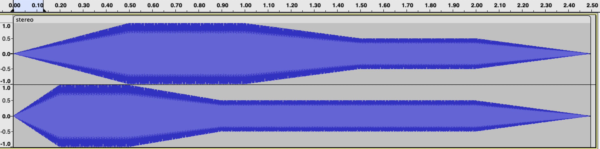

## Creating audio data

You can create some basic audio using ``synth.Sound (frequency:float) (duration:Duration) (waveType:BaseWaves)``

Example:

```fs
let newSound = synth.Sound 440. (Seconds 1.) Sin    // Create a 1 second sinusoidal wave with a frequency of 440Hz.
let newSound2 synth.Sound (synth.getNoteFreq 3 Note.F) Half Triangular // Create a triangular F3 half note.
```

Alternatively, it is possible to directly create a note with the ``synth.Note (duration:Duration) (mNote:Note) (octave:int)``.

Example:

```fs
let newNote = synth.Note Quarter Note.D 5 // Create a D5 quarter note.
```

### Creating audio data with an envelope

In order to create a sound with an envelope you need to use ``synth.SoundWithEnveloppe (frequency:float) (duration:Duration) (waveType:BaseWaves) (sustain:float) (attack:float) (hold:float) (decay:float) (release:float)``.

We are using a basic AHDSR[^6] envelope[^7] :


Example:

```fs
let synth = Synth()
let sound = synth.SoundWithEnveloppe 440. (Seconds 3.) Sin 0.5 0.5 0.5 0.5 0.5  // Create sound with envelope
```

The above example creates the following sound:


<sup>* Please note: when creating a new sound with this method, the release adds data at the end of the normal data.</sup>

### Creating audio data with a custom envelope

Its possible to create sounds with more ezoteric envelopes using the ``Synth.SoundWithCustomEnveloppe (frequency:float) (duration:Duration) (waveType:BaseWaves) (dataPoints: List<float * float>)`` function.

The ``dataPoints`` variable refers to a list of coordinates for which the envelope will "nudge" the sound towards.
It contains a list of tuples, each tuple represents a point in time first and an amplitude second.

For the shake of an example, lets create a simple envelope that only rises up from 0 to 1 and than back again to 0:

First of all, a simple sound withoun an envelope so we'll have a point of reference:

```fs
let synth = Synth() // Init
let basicSound = synth.Note (Seconds 1) Note.A 4

synth.WriteToWav "basic.wav" [basicSound]
```

This, of course, live us with a straight blob of a sinusoidal soundwave with a duration of 1 second:
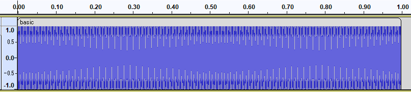

Now if we do the same thing but with our envelope that would look a little like this:

```fs
let synth = Synth() // Init
let custEnvSound = synth.SoundWithCustomEnveloppe (synth.GetNoteFreq Note.A 4) (Seconds 1) Sin [(0., 0.); (0.5, 1.); (1., 0.)]

synth.WriteToWav "custEnvSound.wav" [custEnvSound]
```

The output already looks a bit more interresting:

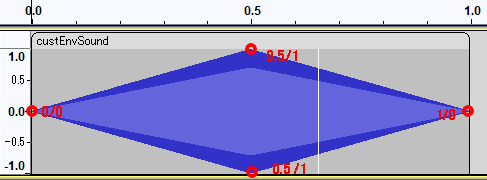

A better way of doing this would be to outright create a function for the new envelope:

```fs
let synth = Synth() // Init

let exampleCustomEnvelope (note:Note) (octav:int) (duration:float) =
    synth.SoundWithCustomEnveloppe (synth.GetNoteFreq note octav) (Seconds duration) Sin [(0., 0.); ((duration/2.), 1.); (duration, 0.)]

let custEnvSound1 = exampleCustomEnvelope Note.A 4 1.
let custEnvSound2 = exampleCustomEnvelope Note.B 6 2.
let custEnvSound3 = exampleCustomEnvelope Note.D 3 3.

synth.WriteToWav "custEnvSound1.wav" [custEnvSound1]
synth.WriteToWav "custEnvSound2.wav" [custEnvSound2]
synth.WriteToWav "custEnvSound3.wav" [custEnvSound3]
```

This way the new, completielly personalised, envelope can easily be applied to a large number of notes.
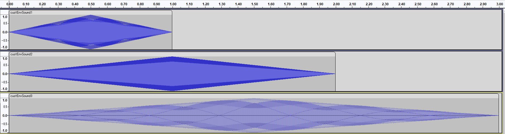

## Finding frequencies from notes and octaves

A more simplified way to find the sound you are looking for is through musical octaves[^1] and notes[^2].
To call on this form of notation you'll have to use the ``synth.GetNoteFreq (note:Note) (octave:int)`` function to get the right frequency.

Example :

```fs
let Note = synth.GetNoteFreq Note.C 4 // This returns the frequency of the C4 note
```

Alternatively, you could directly create a SinWave using the ``synth.Note (duration:Duration) (note:Note) (octave:int)``.

Example :

```fs
let Note = synth.Note Half Note.C 4 // This returns the frequency a half duration of the C4 note
```

### Finding notes with a custom default frequency

In most cases, the frequency of a note is calculated from a default frequency (mostly, 440Hz for the A4 note).
However, in some cases, you might need to find a note from a different starting frequency.
This can be done using the ``synth.GetNoteFreqOffset (note:Note) (octave:int) (aFourFreq:Float)``

Example :

```fs
let Note = synth.GetNoteFreqOffset Note.C 4 444. // This returns the frequency of the C4 note calculated from the starting point 444Hz at the A4 note
```

## Creating silence

Creating silence is as simple as calling the ``synth.Silence (duration:Duration)`` function.

```fs
let Silence = synth.Silence (Seconds 2) // Returns 2 seconds of silence
```

## Cutting audio

Cutting audio is simple. You can use the following functions

- ``synth.CutStart (time:float) (data:List<float>)`` : Cuts the start of the audio data returning the end part
  
- ``synth.CutEnd (time:float) (data:List<float>)`` : Cuts the end of the audio data returning the first part
  
- ``synth.CutMiddle (timeStart:float) (timeEnd:float) (data:List<float>)`` : Cuts out the middle of the audio data and returns the edges merged together
  
- ``synth.CutEdge (timeStart:float) (timeEnd:float) (data:List<float>)`` : Cuts of both ends of the audio data and returns the middle part

Example :

```fs
let a = synth.Note (Seconds 1) Note.A 4
let b = synth.Note (Seconds 1) Note.B 4
let c = synth.Note (Seconds 1) Note.C 4
let d = synth.Note (Seconds 1) Note.D 4

let full = synth.Compose [a; b; c; d;]        // Complete sound, takes 4 second and plays 4 different notes

let lastThree = synth.CutStart 1. full   // Cuts first note, leaving last 3
let firstThree = synth.CutEnd 1. full    // Cuts last note, leaving first 3
let edges = synth.CutMiddle 1. 1. full   // Cuts out the 2 middle notes, leaving the first and the last ones
let second = synth.CutMiddle 1. 2. full  // Cuts the first and the last 2 notes, leaving the second one
```

## Superposing audio data

You can superpose different sounds together to get a 3rd that is the result of the operation. You have different functions to superpose sounds to help you easily get what you want.

### Superposing audio with a predefined ratio

There is the function ``synth.Add sounds``. The variable sounds is a List<List<float>> containing the list of sounds that will be superposed together. This function will superpose the sounds together and average the values depending on the number of waves superposed.

Example:
```fs
let sound1 = synth.Compose [synth.Note Eighth Note.C 5]
let sound2 = synth.Compose [synth.Note Eighth Note.B 8]
let sound3 = synth.Compose [synth.Note Eighth Note.A 1]

let added = synth.Add [sound1;sound2;sound3]
```

### Superposing audio with a custom ratio

There is the function ``Utility.AddFactor (map:List<Tuple<List<float>, float>>)``. The variable map contains a list of tuple containing the sounds the user wants to superpose together and the ratio of the sound.

Example:
```fs
let sound1 = synth.Compose [synth.Note Eighth Note.C 5]
let sound2 = synth.Compose [synth.Note Eighth Note.B 8]
let sound3 = synth.Compose [synth.Note Eighth Note.A 1]

let added = Utility.AddFactor [(sound1,0.2);(sound2,0.5);(sound3,0.3)]
```

It is recomended that the total ratios the user uses is equal to 1. Otherwise the user can use the function ``Utility.Maximize data``. This function will take the data of a sound and modify it so that the amplitude goes from -1 to 1.

### Superposing audio without ratios

There is the function ``AddSimple (sounds:list<list<float>>)``. This function will return the highest absolute value of the data. 

Example:
```fs
let sound1 = synth.Compose [synth.Note Eighth Note.C 5]
let sound2 = synth.Compose [synth.Note Eighth Note.B 8]

let added = Utility.AddSimple [sound1;sound2]
```

## Composing

One thing you have to be aware of is the ``CutCorners`` function.
When we first created the compose function we encountered a strange, small sound between each end every note.
This sound was caused by the notes ending on a not-zero amplitude.

The solution was to add in a filter that gradually lowers the amplitude of the notes start and end to 0.

|          Before cutCorner             |          After cutCorner            |
|:------------------------------------:|:-----------------------------------:|
|   |   |
<sup>* for the sake of the example, the filter has been exaggerated</sup>

Therefore; the ``synth.Compose (sounds:List<float>)`` function has a default cutCorner value of 100 (this means it cuts away from the first and last 100 bytes from each note).

Example :

```fs
let C4 = synth.Note Half Note.C 4   // init
let D4 = synth.Note Half Note.D 4   //
let Silence = synth.Silence Quarter //
let B5 = synth.Note Half Note.B 5   //

let Music = synth.Compose [ C4; C4; D4; Silence; B5 ] // Returns a single, large sound composed of the smaller sounds given to it
```

In certain cases, one might need to set a custom value to the cutCorner function.
This can be done with ``synth.ComposeCutCorner (limit:int) (sounds:List<float>)``

```fs
let Music = synth.ComposeCutCorner 1000 [
    C4
    C4
    D4
    Silence
    B5
]
```

Alternatively, one might want to compose without the cutCorners filter.
This can be done either by giving it a 0 value or by using the ``synth.ComposeCutCorner (corner:int) (sounds:List<float>)`` function.

With zero value :

```fs
let Music = synth.ComposeCutCorner 0 [ C4; C4; D4; Silence; B5 ]
```

Or with ``synth.ComposeNoCutCorner (sounds:List<float>)`` :

```fs
let Music = synth.ComposeNoCutCorner [ C4;  C4; D4; Silence; B5 ]
```

These two are equivalents.

## Preview

It is possible to create a preview of an audio loaded into the filter using the ``synth.Preview (title:string) (sound:List<float>)`` function with Xplot.Plotly[^9].

Example :

```fs
let basic = synth.Note Whole Note.A 2       // Creating a basic note
let cut = Utility.CutCorners 5000 basic     // Making it look a bit more interesting

synth.Preview "Example" cut |> ignore       // Launch preview
```

The above example automatically opens the browser with the following image :


Tools to zoom in/zoom out are also present on the page.

## Frequency analysis

It's possible to do frequency analysis by using a Fourier transform on an audio file using :
``Synth.Fourier (data:List<float>)``

Example :

```fs
let A345 = synth.Add [
    synth.Note Whole Note.A 3
    synth.Note Whole Note.A 4
    synth.Note Whole Note.A 5
]

let analysis = synth.Fourier A345
synth.PreviewMap "Analysis of A3, A4, A5" analysis
```

The above example automatically opens the browser with the following graph:


> Note: Tools to zoom and move are present on the page.

To extract the main harmonics from the analysis, use `FrequencyAnalyser.LocalMaxValuesIndices (threshold: float) (map: Map<float, float>)`

For example, with the previous code, running
```fs
let frequencies = FrequencyAnalysis.LocalMaxValuesIndices 0.2 analysis
printfn "Frequencies: %A" frequencies
```
will output `Frequencies: [220.0457771; 440.0915541; 879.8466468]`

## Filters

### Currently accessible Filters

To complement your music, its possible to add filters to your audio data :

- Amplitude changer : Changes the amplitude of a given sound.
  
- Echo : Repeats and periodically scales down the sound, creating an echo like effect.

- Reverb : Repeats the sound similarly to the echo effect, but does it so before the sound could finish playing, creating a more vibrant sound.

- Flanger : Adds a sweeping sound effect to the audio.

- Envelope : Modifies the way the amplitude of the sound changes over time.

- LFO[^8] AM : Amplitude modulation using a low frequency oscillator.

- LFO FM : Frequency modulation using a low frequency oscillator.

- Low Pass : Cuts off frequencies above a given threshold.

- High Pass : Cuts off frequencies under a given threshold.

- BandPass/RejectBand : Cuts off frequencies both above and under the given thresholds and inverse.
  
### Apply multiple filters at once

You can use this function to apply multiple filters at once like so :

```fs
let MusicWithFilters = synth.ApplyFilters [
    synth.ChangeAmplitude 0.5
    synth.LowPass 400.
    synth.Echo 4 0.7 1.5] music
```

### Changing amplitude

To change the amplitude of a sound, use the ``Synth.ChangeAmplitude (amplitude:float)`` filter like so :

```fs
let MusicWithAmplitude = synth.ChangeAmplitude 0.5 Music
```

### Custom repeater filter

The repeater filter does exactly what it says on the tin.
It repeats the inputted data with an offset and reads to the original sound.
This filter is the basis on which we built the Reverb and Echo filters.

The function looks like this : ``Synth.Repeater (nbEcho:int) (decay:float) (delay:float) (dryData:List<float>)``

The variables inputed are :

- nbEcho : The number of times the original sound gets repeated.
- decay : Each time the sound is repeated we adjust the amplitude of the sound using this value
- delay : The offset added to the echo (multiplies accordingly to the echo ex : echo 1 will have 1x this value, echo 2 will have 2x this value, etc..)
- dryData : The original sound

Example :

```fs
let basicSound = synth.SoundWithEnveloppe 440. (Seconds 3.) Sin 0.5 0.5 0.5 0.5 0.5 // Creating a basic sound with an envelope to make it interesting

let repeated1 = synth.Repeater 5 0.6 2.5 basicSound
let repeated2 = synth.Repeater 5 0.9 4. basicSound
```

The above examples give the following outputs :


### Echo

The echo filter repeats the same sound with a delay between delays and continuously weakens the the new sounds creating an echo effect.

``synth.Echo (nbEcho:int) (decay:float) (delay:float) (dryData:List<float>)``

In this case, the delay is the time period between two echos, and NOT the delay from the start of the sound.

Example :

```fs
let basicSound = synth.SoundWithEnveloppe 440. (Seconds 1.) Sin 0.5 0.2 0.2 0.2 0.2 // Creating a basic sound with an envelope to make it interesting

let echo = synth.Echo 3 0.6 0.25 basicSound
```

The above examples give the following outputs :
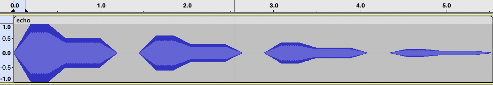

### Reverb

Similarly to echo, reverb repeats and reads the same sound with a delay.
Except, reverb does so with a delay that is shorter then the original sound.

``Synth.Reverb (delayRatio:float) (minAmpRatio:float) (decay:float) (dryData:List<float>)``

Instead of a fixed time, we are using ratio between the the delay and the length of the sound.
This way, we can just simply input a value between 0 and 1, in which the filter gets more and more pronounce towards 1 instead of needing to play attention to the length of the sound.

Example:

```fs
let basicSound = synth.SoundWithEnveloppe 440. (Seconds 1.) Sin 0.5 0.2 0.2 0.2 0.2 // Creating a basic sound with an envelope to make it interesting

let reverb = synth.Reverb 0.4 0.3 0.8 basicSound
```

The above examples give the following outputs:
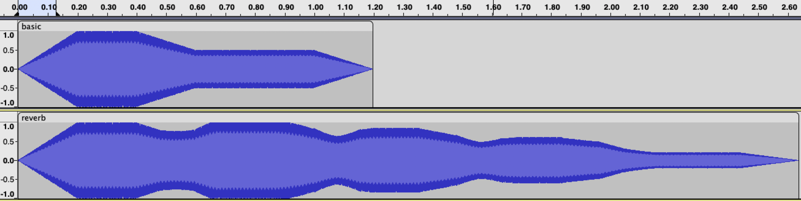

### Flanger

The flange filter is used to add kind of sweeping sound to the audio.
``Synth.Flanger (delay:float) (speed:float) (dryData:List<float>)``

Example:
```fs
    let synth = Synth() // Init
    let basicSound = synth.SoundWithEnveloppe 440. (Seconds 1.) Sin 0.5 0.2 0.2 0.2 0.2 // Creating a basic sound with an envelope to make it interesting
    let flanger = synth.Flanger 20. 0.4 basicSound //Adding filter
    
    synth.WriteToWav "basic.wav" [basicSound]
    synth.WriteToWav "flanger.wav" [flanger]
```
The results are:
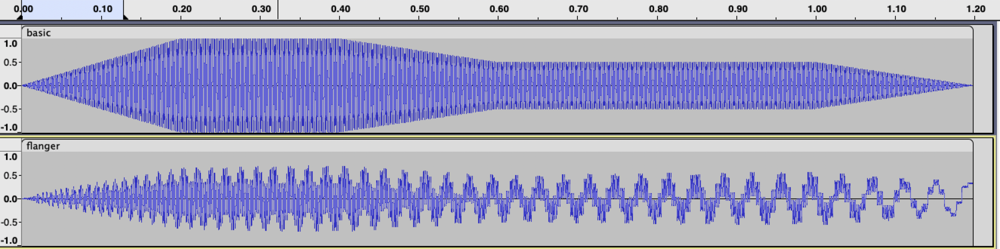

### Envelope

Just like when we create a sound, we can make an envelope to make the amplitude of a  given audio data follow certain patterns.

We are still using a basic AHDSR envelope :


``Synth.Envelope (sustain:float) (attack:float) (hold:float) (decay:float) (release) (data:List<float>)``

Example:

```fs
let synth = Synth()
let basic = synth.Note (Seconds 3.) Note.A 4
let env = synth.Envelope 0.5 0.5 0.5 0.5 0.5 basic

synth.WriteToWav "basic.wav" [basic]
synth.WriteToWav "env.wav" [env]
```

The above example creates the following sound:
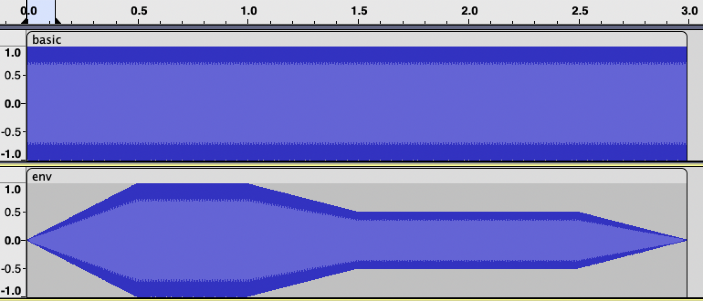

<sup>* Please note: when adding an envelope on top of an already existing sound using this method, the release is accounted into the already existing data and the length of the data does not change.</sup>

### Custom envelope

Just like on creation, it is rather simple to insert a custom pattern into the anvelope.
This is done using the  ``Synth.CustomEnvelope (dataPoints0: List<float * float>) (data:List<float>)`` function.

For example, to create a simple filter that starts at 0 then rises to the maximum amplitude at the middle of the sound, then falls back to 0:

```fs
let synth = Synth() // Init

let exampleCustomEnvelope (data:List<float>) =
    Filter.CustomEnvelope [(0., 0.); ((float data.Length / synth.sampleRate / 2.), 1.); ((float data.Length / synth.sampleRate), 0.)] data

let custEnvSound1 = exampleCustomEnvelope (synth.Note (Seconds 1) Note.A 4)
let custEnvSound2 = exampleCustomEnvelope (synth.Note (Seconds 2) Note.B 4)
let custEnvSound3 = exampleCustomEnvelope (synth.Note (Seconds 3) Note.C 4)

synth.WriteToWav "custEnvSound1.wav" [custEnvSound1]
synth.WriteToWav "custEnvSound2.wav" [custEnvSound2]
synth.WriteToWav "custEnvSound3.wav" [custEnvSound3]
```

This way the new, completielly personalised, envelope can easily be applied to a large number of notes.
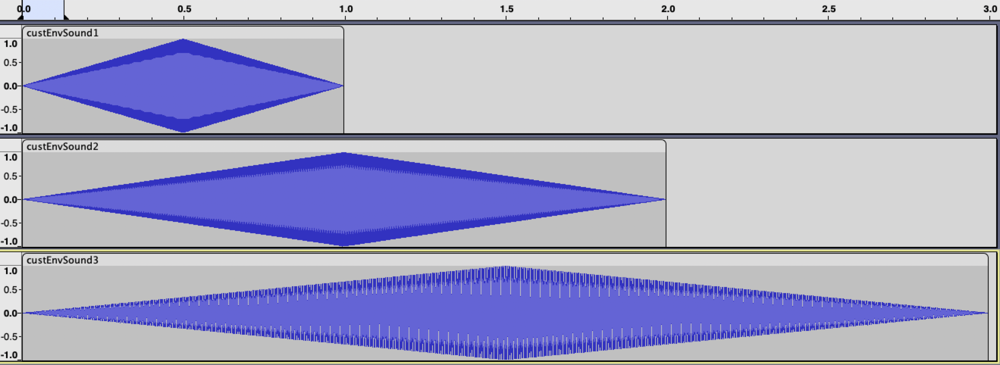

### Low frequency oscillation

<span style="color: red;">WIP</span>

#### AM

The Amplitude Modulation using a Low Frequency Oscillator (LFO AM) also called tremolo changes, as the name, implies the frequency of a sound based on a small frequency.
This allows for a kind of wobble effect, alternating the amplitude between its maxima in a sinusoidal fashion.

The function takes not only the modulating frequency as parameter but also the new lower and upper bounds (usually -1. and 1.) and the music's sample rate.

Here is an usage example:

```fs
let basic = synth.Note (Seconds 10.) Note.A 4
let sound = synth.LFO_AM 60. -1. 1. basic
```

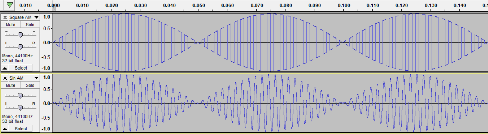

#### FM

As the name implies, Frequency modulation alternatively increases and decreases the frequency of the input data.
``Synth.LFO_FM (modWave:List<float>) (multiplicator:float) (data:List<float>)``

The ``modWave`` stands for an inputed wave which the function will follow to modulate the inputed data.
The ``multiplicator`` is there to help control how strong the effect of the filter is.

Example:
```fs
let synth = Synth() // Init

let basic = synth.Note (Seconds 2.) Note.A 4      // Creating a basic note
let modWave = synth.Sound 100. (Seconds 2.) Sin   // Creating a modWave of 100Hz
let fm = synth.LFO_FM modWave 2. basic           // Applying the LFO FM filter

synth.WriteToWav "basic.wav" [basic]
synth.WriteToWav "modWave.wav" [modWave]
synth.WriteToWav "fm.wav" [fm]
```
The output is:
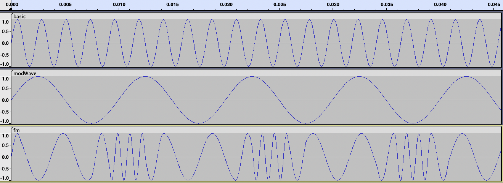


### LowPass / HighPass / BandPass / RejectBand filters

These are 4 filters applicable to the audio data.

They are used to cut off frequencies above a given threshold, below a given threshold, both above and below a given threshold, or both above and below a given threshold and inverse.

They are used like so :

```fs
  let musicLowPass = synth.LowPass cutOffFreq Music
```

```fs
  let musicHighPass = synth.HighPass cutOffFreq Music
```

```fs
  let musicBandPass = synth.BandPass lowCutOffFreq highCutOffFreq Music
```

```fs
  let musicRejectBand = synth.RejectBand lowCutOffFreq highCutOffFreq Music
```

# Footnotes

## Musical notes

The musical notes available are :
> ``C``,  ``Cs / Db``, ``D``, ``Ds / Eb``, ``E``, ``F``, ``Fs / Gb``, ``G``, ``Gs / Ab``, ``A``, ``As / Bb``, ``B``

## Wave functions[^3]

The wave types available are :
> ``Sin``, ``Square``, ``Triangular``, ``Saw``, ``Silence``, ``CustomInstrument``

- The ``CustomInstrument`` value has a value of ``(float -> float -> float -> float -> float -> float)``. This is because the wave functions need to be written as:

```fs
let WaveFunc (frequency:float) (amplitude:float) (verticalShift:float) (phaseShift:float) (timeLength:float) 
```

## Duration of elements

The note durations[^5] available are :
> ``Whole``, ``Half``, ``Quarter``, ``Eighth``, ``Sixteenth``, ``Custom``, ``Seconds``

- The Seconds value takes a float as argument.
- The Custom value takes a float as its argument. This translates using the formula ``value *4.* 60. / bpm``.
- The tempo of the music can be changed by changing the value ``synth.SetBpm`` (default 90).

## Unit Test

The tests can be found in the Synthesizer.Test project. To run them you'll have to be located in the project folder and run the dotnet test command.

## See Also

Info on [**.mp3 files**](https://github.com/ClementCaton/ALGOSUP_2022_Project_3_A/blob/main/Informations/INFO%20mp3.md)<br>
Info on [**.Wav files**](https://github.com/ClementCaton/ALGOSUP_2022_Project_3_A/blob/main/Informations/INFO.md)<br>
Link to our [**Trello**](https://trello.com/b/itooTuBY/algosup2022project3a)<br>
Link to our [**Functional Specifications**](https://github.com/ClementCaton/ALGOSUP_2022_Project_3_A/blob/main/Reports/Functional%20specification.md)<br>
Link to our [**Technical Specifications**](https://github.com/ClementCaton/ALGOSUP_2022_Project_3_A/blob/main/Reports/Technical%20specification.md)<br>
Link to our [**Software Architecture Design Choices**](https://github.com/ClementCaton/ALGOSUP_2022_Project_3_A/blob/main/Reports/Software%20architecture%20design%20choices.md)

## **Definitions**

[^1]: [Octave](https://en.wikipedia.org/wiki/Octave): A series of eight notes occupying the interval between (and including) two notes, one having twice or half the frequency of vibration of the other.

[^2]: [Note](https://en.wikipedia.org/wiki/Musical_note) : A note is a symbol denoting a musical sound.

[^3]: [Basic Waves functions](https://www.musictheory.net/lessons/11):<br>A wave function is a mathematical function which can create a wave of a predefined pattern frequency, amplitude, etc.. In the scope of this project we are using the four basic waveforms: Sinusoidal, Square, Triangular and Saw.<br>The four basic waves are -><br><br>The sin wave = the simplest wave with a formula of *sin(2 π  frequency / sampleRate)* <br><br>The square wave = a wave made with an sgn of a sinwave with a formula of *sgn(sinwave)*<br><br>The saw wave = has a form close to a triangle, it has a right angle at the end of its decreasing part *2(t/p - [1/2+t/p]*<br><br>The triangle wave = this wave has the most complicated formula *period/π arcsin[sin(π x)]*

[^4]: [beat](https://en.wikipedia.org/wiki/Beat_(music)): Beats is a sort of rythm; 2 beat per second is like a tempo, it will happen two time in a second

[^5]: Musical durations: <br>
Musical duration is measured in beats[^4] <br>
``Whole last 4 beats``<br> ``Half last 2 beats``<br> ``Quarter last 1 beat``<br> ``Eighth last 1/2 beat``<br> ``Sixteenth last 1/4 beat``<br> ``Custom depends of the number of beat``<br> ``Seconds last the number of beats in the number of seconds written``

[^6]: AHDSR: <br>An Envelope parameters -><br> Attack is the time taken for initial run-up of level from nil to peak, beginning when the key is pressed.<br><br>Hold time allows you to adjust the time that the peak amplitude level is held before the decay stage of the envelope begins.<br><br>
Decay is the time taken for the subsequent run down from the attack level to the designated sustain level.<br><br>
Sustain is the level during the main sequence of the sound's duration, until the key is released.<br><br>
Release is the time taken for the level to decay from the sustain level to zero after the key is released

[^7]: [Envelope](https://theproaudiofiles.com/synthesis-101-envelope-parameters-uses/): The envelope is the way a sound change over time. It usually enables you to control the wave forms with the AHDSR parameters.

[^8]: [LFO / Low frequency oscillator](https://en.wikipedia.org/wiki/Low-frequency_oscillation): Is an oscillator performing under 20Hz to create audio effects such as vibrato and phasing.

[^9]: [Xplot.Plotly](https://fslab.org/XPlot/plotly.html): Is a nuget which allowsto view data in the form of graphs

[^10]: [Stereo](https://en.wikipedia.org/wiki/Stereophonic_sound): Stereo in opposition to mono, is a sound using multiple audio source (usually 2) to recreate a multi-directional / 3D-sound.

[^11]: [Sample rate](https://www.vocitec.com/docs-tools/blog/sampling-rates-sample-depths-and-bit-rates-basic-audio-concepts#:~:text=The%20sampling%20rate%20refers%20to,a%20specific%20point%20in%20time.):The sampling rate refers to the number of samples of audio recorded every second. 

