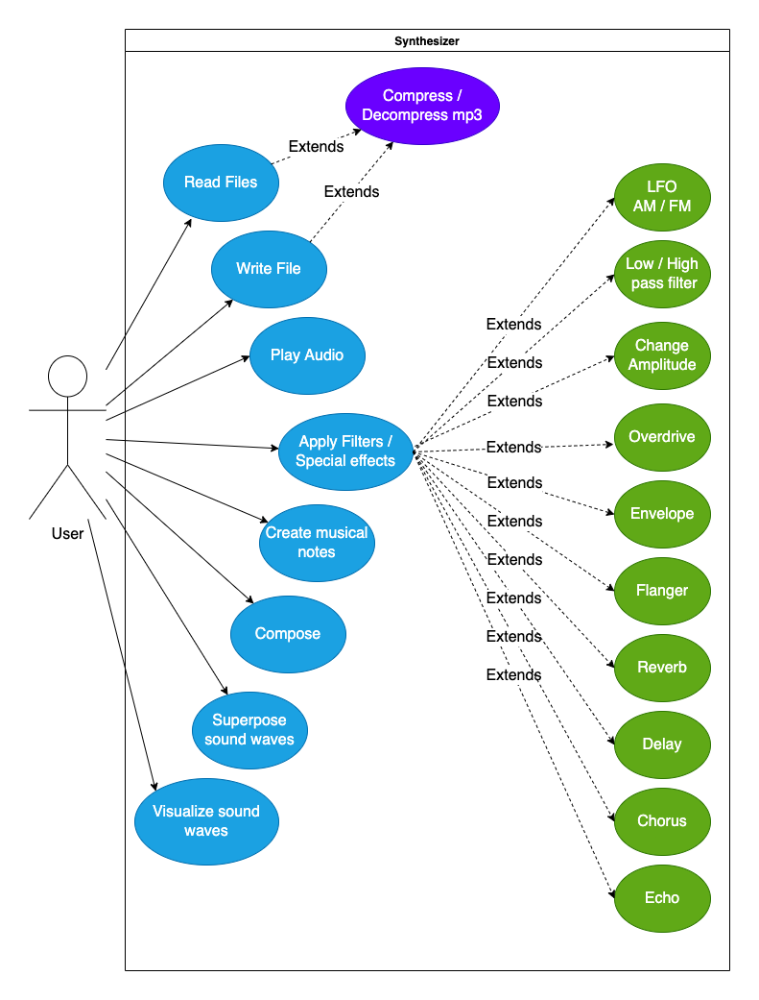

# Functional specification

## What is it ? 
The synthesizer is used for musical applications. It can create and modify musical notes as well as compose melodies out of them.

In our case, the objective is to create a programmable synthesizer.

## Who is our targeted audience

Any person interested in sound synthesis should be able to use this project.

## Use case :

## What can the user do 

While the Library will possess a variety of functions to ease the developpement process. The ones that are used by the users are rather simple:

- Synth.Read
  - Reads a file (.wav or .mp3 formats)
  
- Synth.Write
  - Writes a file (.wav or .mp3 formats)
  
- Synth.Play
  - Plays sound data
  
- Synth.GetNote
  - Returns the sound data of a given musical note with a given duration, note and octave
  
- Synth.Compose
  - Returns complex sound data from a list of notes (music)
  
- Synth.Add
  - Superpose notes (with a possible temporal offset) to allow for multiple notes to be played at the same time
  
- Synth.ApplyFilterX
  - Applies a filter to a given sound (X replaces with the filter in question)
  
- Synth.Preview
  - Gives a visual display of the sound waves generated using Xplot

