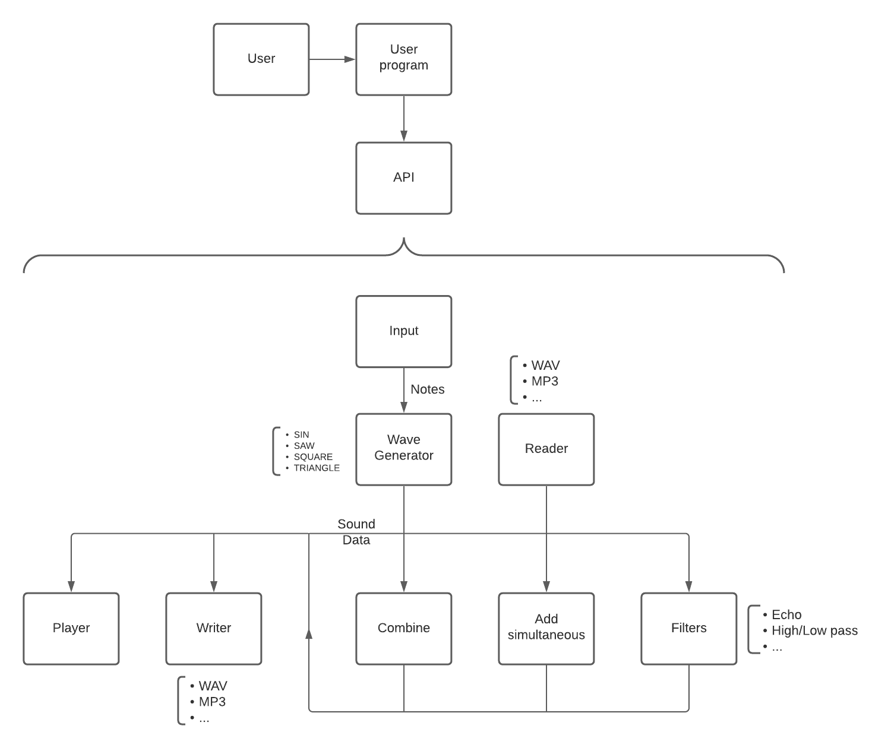

# Software architecture design choices
## Architecture tree

The architecture of the application is planned to posess three main parts:
- program.fs :
    > This part of the application is where the users could input thier part of the code thereby composing their musical pieces.
    > This part of the application should be empty on itialisation.

- API.fs :
    > This is where the users access the synthesizer library.
    > The main reason why we need this is to simplify the process the users will have to go trough troughout their work.

- The back end:
    > This is where the magic happens.
    > This part of the application encompasses more-or-less every other file within the project.
    > More importantly, these functions are not made to be called directly but to be used trough the API.
    > 
    > The architecture behind this (rather more robust) part of the application focuses on separating files from the raw data.
    > The only times we touch actual files is when we read and write said files. In any other situation we work with raw information.