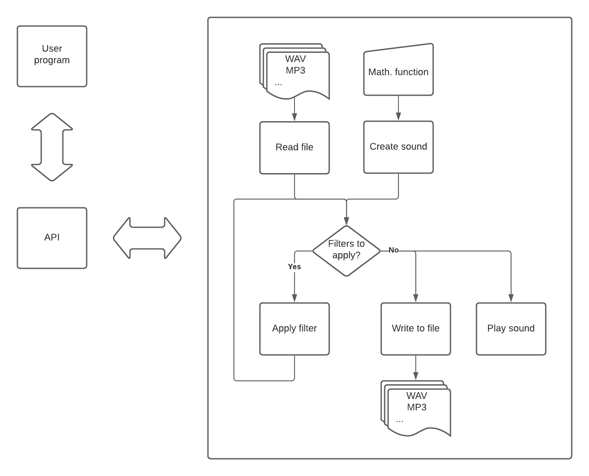

# Software architecture design choices
## Architecture tree

The architecture of the application is planned to posess three main parts:
- program.fs :
    > This part of the application is where the users could input thier part of the code thereby composing their musical pieces.
    > This part of the application should be empty on itialisation.

- API.fs :
    > This is where the users access the synthesizer library.
    > The main reason why we need this is to simplify the process the users will have to go trough troughout their work.

- The back end:
    > This is where the magic happens.
    > This part of the application encompasses more-or-less every other file within the project.
    > More importantly, these functions are not made to be called directly but to be used trough the API.
    > 
    > The architecture behind this (rather more robust) part of the application focuses on separating files from the raw data.
    > The only times we touch actual files is when we read and write said files. In any other situation we work with raw information.

## API access architecture

While the API will possess a variety of functions to simplify the developpement process the ones that are supposed to be used by the users are rather simplified:

- API.Read
  - Reads a file (.wav or .mp3 formats)
- API.Write
  - Writes a file (.wav or .mp3 formats)
- API.Play
  - PLays sound data
- API.GetNote
  - Returns the sound of a given musical note from a duration, note and octav
- API.Compose
  - Returns a complex sound from a list of notes (music)
- API.ApplyFilterX
  - Applies a filter to a given sound (X replaces with the filter in question)
- API.Preview
  - Gives a visual display of the soundwaves generated using Xplot

